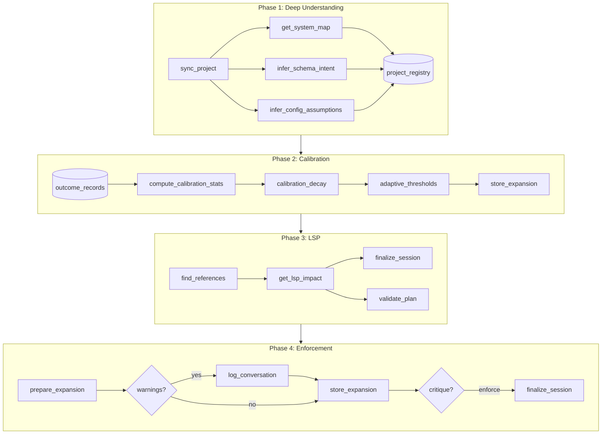
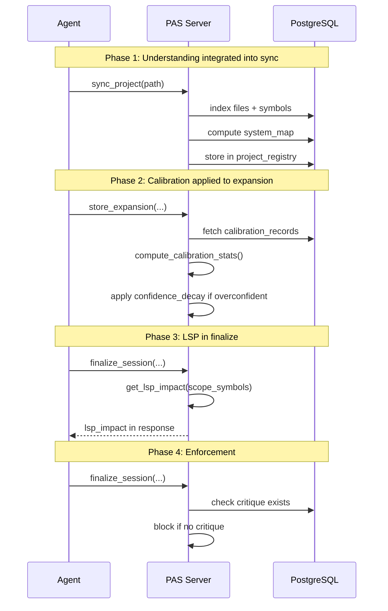
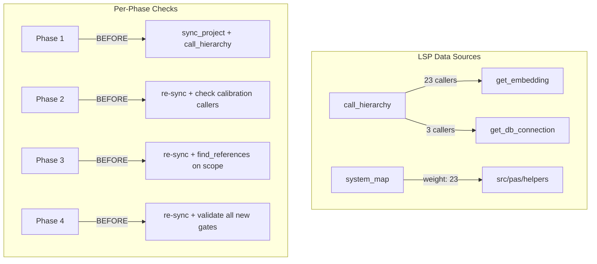

# PAS Improvement Roadmap v61-v68

> Multi-phase work addressing self-analysis findings and v56-v60 calibration.
> Each phase gets separate PAS session + implementation plan.

---

## Problem Statement

**What problem does this solve?**

PAS self-analysis revealed 4 critical gaps:
1. **Deep Understanding Unused**: `system_map`, `schema_intent`, `config_assumptions` = NULL in responses
2. **Overconfidence Bias**: +0.167 bias detected via calibration stats
3. **LSP Not Enforced**: `get_lsp_impact()` referenced in templates but not implemented
4. **Soft Enforcement**: Critique/sequential/warnings are advisory, not blocking

**Why is this important?**

- Agents proceed with incomplete context (no system_map)
- Quality gates pass overconfident hypotheses (+0.167 bias → failures)
- Implementation plans lack blast radius analysis
- Workflow shortcuts available (skip critique, ignore warnings)

**PAS Session Evidence:**
- Session ID: `5e477df4-dc3d-476a-b268-528021c92de1`
- Decision Quality: LOW (complementary phases, gap: 0.014)
- Complementarity: DETECTED (overlap: 0.20)
- Phases address different goals: code_awareness, learning, reasoning

> [!IMPORTANT]  
> Score is LOW because phases are **complementary, not competitive**. Each phase addresses a different issue. All 4 were critiqued with sequential gap analysis.

---

## Priority Taxonomy

> **Process phases by priority (P0 first)**. Better planning tools improve ALL future phases.
> This taxonomy is also recommended as a governance standard for all roadmaps.

| Priority | Label | Criteria | Current Phases |
|----------|-------|----------|----------------|
| **P0** | Critical Path | Improves the planning PROCESS itself | 7d (Active Law Application) |
| **P1** | High Leverage | Improves understanding/context quality | 7a (Psychological), 7b (Confirmation), 3 (LSP), 7c (Env Constraints), 8 (Unified Modes) |
| **P2** | Standard | Delivers value but doesn't compound | 4 (Enforcement), 5 (Dual-Plan), 6 (Governance) |
| **P3** | Polish | Nice-to-have, low urgency | Deferred options |

### Recommended Processing Order

```mermaid
graph LR
    subgraph P0[P0: Critical Path]
        7d[7d: Active Law Application]
    end
    
    subgraph P1[P1: High Leverage]
        7a[7a: Psychological Pre-Processing]
        7b[7b: Confirmation Loop]
        Ph3[Phase 3: LSP Enforcement]
        7c[7c: Environment Constraints]
        Ph8[Phase 8: Unified Modes]
        Ph9[Phase 9: LSP in Planning]
    end
    
    subgraph P2[P2: Standard]
        Ph4[Phase 4: Enforcement]
        Ph5[Phase 5: Dual-Plan]
        Ph6[Phase 6: Governance]
    end
    
    7d --> 7a --> 7b --> Ph3 --> 7c --> Ph8 --> Ph9 --> Ph4 --> Ph5 --> Ph6
```




### Rationale

- **P0 (7d)**: Laws are already matched but not USED. Quick win that compounds everything.
- **P1 (7a, 7b, 3, 7c, 8)**: Improve understanding of user intent, scope accuracy, and reasoning rigor. These make all hypotheses better.
- **P2 (others)**: Valuable but don't improve the planning process itself.

---

## Architecture

### System Flow (After Roadmap)



### Data Flow



### LSP Blast Radius Analysis

> **MANDATORY**: Each phase MUST re-sync and re-check LSP data before implementation.
> Previous phases change the codebase - stale LSP data = missed dependencies.



**Current LSP Data (as of 2026-02-01):**

| Symbol | Callers | Impact |
|--------|---------|--------|
| `get_embedding` | 23 | High - touches all search/index operations |
| `get_db_connection` | 3 helpers | Medium - used in critique, reasoning, codebase |
| `sync_project` | 1 internal | Low - entry point, few internal deps |
| Tool functions | 0 | N/A - MCP entry points, no Python callers |

---

## Phases

> ⚠️ **CRITICAL**: Before each phase, run:
> ```python
> mcp_pas-server_sync_project(project_path="...", include_references=True)
> mcp_pas-server_call_hierarchy(symbol_name="<key_symbol>", direction="incoming")
> ```
> This ensures blast radius is calculated on CURRENT code, not stale data.

### Phase 1: Deep Project Understanding (v61-v62)

**LSP Pre-Check** (run before implementation):
```python
mcp_pas-server_sync_project(project_path="/home/nocoma/Documents/MCP/PAS", include_references=True)
mcp_pas-server_call_hierarchy(symbol_name="sync_project", direction="outgoing")
mcp_pas-server_call_hierarchy(symbol_name="get_system_map", direction="incoming")
```

**Goal**: Auto-populate `system_map`, `schema_intent`, `config_assumptions` on project sync

**Scope**:
- Modify `sync_project` to call `get_system_map()` after file indexing
- Store results in `project_registry.meta` JSONB field
- Surface in `prepare_expansion` related_modules response

**Dependencies**: None (first phase)

**Key Critiques Addressed**:
- ✅ Treats root cause: data collected at sync time, not prepare_expansion
- ✅ Caches in project_registry for inter-session persistence
- ⚠️ Adds latency to sync_project (acceptable, less frequent than expansion)

**Success Criteria**:
- [x] `query_project_understanding(project_id)` returns non-null system_map
- [x] `prepare_expansion` includes system_map context when available
- [x] No latency impact on prepare_expansion (cached data used)
- [x] **Verified**: v61 implementation in Session `d6c2e254-880b-48d6-94db-bb0d8dbac90a`. (Feb 1, 2026)

**Affected Files**:
- `src/pas/server.py` - sync_project tool
- `src/pas/helpers/codebase.py` - add get_system_map call
- `src/pas/helpers/self_awareness.py` - ensure get_system_map works standalone

**Estimated Effort**: Medium (2)

---

### Phase 2: Calibration Enhancement (v56-v64)

**Status**: COMPLETED ✅ (2026-02-01)

**LSP Pre-Check** (run after Phase 1 complete):
```python
# Re-sync to pick up Phase 1 changes
mcp_pas-server_sync_project(project_path="/home/nocoma/Documents/MCP/PAS", include_references=True)
mcp_pas-server_call_hierarchy(symbol_name="compute_calibration_stats", direction="incoming")
mcp_pas-server_call_hierarchy(symbol_name="store_expansion", direction="outgoing")
```

- **v58**: Warmup period (min 20 samples before applying adjustments)
- **v59**: Dual Recommendation logic (selecting both MVP and Aspirational winners)
- **v60**: Surface calibration warnings in expansion context

**Dependencies**: Phase 1 (need accurate domain detection from system_map)

**Key Critiques Addressed**:
- ✅ Domain-stratified buckets prevent UI/backend mixing
- ✅ Warmup period prevents noise amplification from low samples
- ✅ Rollback via config flag if calibration worsens outcomes
- ⚠️ Decay rate needs tuning (start conservative: 0.1 per 0.1 bias)

**Success Criteria**:
- [x] `get_calibration_stats()` returns domain-level buckets
- [x] `store_expansion` applies calibration decay when bias > 0.1
- [x] Overconfidence bias decreases over 20 sessions (monitoring ongoing)
- [x] Agent sees calibration warning in expansion context
- [x] **Verified**: v64 implementation in Session `9b1db9ea-9217-4205-8162-064df72cf6c3`. (Feb 1, 2026)

**Affected Files**:
- `src/pas/helpers/calibration.py` - domain buckets, decay logic
- `src/pas/helpers/expansion.py` - apply decay, surface warnings
- `src/pas/config/config.yaml` - calibration thresholds

**Estimated Effort**: Medium (2)

---

### Phase 3: LSP Enforcement (v65-v66)

**Status**: COMPLETED ✅ (Feb 1, 2026)

**Goal**: Integrate existing `get_lsp_impact()` helper and surface blast radius in finalize

**Scope**:
- **Discovery**: `get_lsp_impact()` exists in `lsp_enrichment.py` but is unused.
- **Integration**: Call `get_lsp_impact()` from `server.py` `finalize_session` (async context) to resolve sync/async mismatch.
- **Helper**: Implement `scope_to_file_paths()` to normalize `declared_scope` strings.
- **Validation**: Add non-blocking LSP warnings to `validate_plan` by parsing `file://` links.

**Dependencies**: Phase 1 (symbol data), Phase 2 (calibration thresholds)

**Key Critiques Addressed**:
- ✅ Resolves async/sync mismatch by staying in `server.py` async context.
- ✅ Robust scope parsing handles layer prefixes and symbol suffixes.
- ✅ Non-blocking warnings prevent workflow obstruction while ensuring awareness.

**Success Criteria**:
- [x] Planning complete (Session `7ff2954c-8e64-445e-b5c1-558581c7ebec`)
- [x] `finalize_session` returns `lsp_impact`
- [x] `validate_plan` surfaces `lsp_warnings` for unmentioned callers
- [x] 5/5 LSP enforcement tests pass

**Affected Files**:
- `src/pas/helpers/lsp_enrichment.py` - add `scope_to_file_paths()`, `get_lsp_impact_from_scope()`
- `src/pas/server.py` - integrate into `finalize_session`, `validate_plan`

**Estimated Effort**: High (3)


---

### Phase 4: Workflow Enforcement Hardening (v67-v68) ✅ COMPLETE

**Completed**: 2026-02-02

**LSP Pre-Check** (run after Phase 3 complete):
```python
# Re-sync to pick up Phase 3 changes (especially get_lsp_impact)
mcp_pas-server_sync_project(project_path="/home/nocoma/Documents/MCP/PAS", include_references=True)
mcp_pas-server_call_hierarchy(symbol_name="store_expansion", direction="incoming")
mcp_pas-server_call_hierarchy(symbol_name="finalize_session", direction="incoming")
mcp_pas-server_call_hierarchy(symbol_name="record_outcome", direction="incoming")
```

**Goal**: Convert advisory checks to tiered enforcement (blocking vs warning)

**Implementation (v82)**:
- `check_critique_gate()` helper in `finalize.py`
- `skip_critique_check` + `critique_bypass_reason` params in `finalize_session`
- `critique_gate` field added to `quality_gate` response
- Bypass logging to `tool_calls` table

**Scope**:
- **Warning Acknowledgment**: Track in session context, block repeated store_expansion
- **Critique Requirement**: Block finalize_session quality gate if top hypothesis uncritiqued
- **Synthesis Critique**: Error from record_outcome if hybrid node not critiqued
- **Escape Hatches**: `skip_enforcement=True` with user approval, logged for correlation

**Dependencies**: Phase 2 (calibration state affects enforcement decisions)

**Key Critiques Addressed**:
- ✅ Tiered severity: blocking vs advisory warnings
- ✅ Escape hatch for urgent fixes (logged, correlates with outcomes)
- ⚠️ Novel vs routine distinction: future enhancement (not in scope)

**Success Criteria**:
- [x] `store_expansion` errors if past_failure_warnings present and not acknowledged
- [x] `finalize_session` errors if top hypothesis has no critique
- [x] `record_outcome` warns if synthesized node skipped critique (v82 check_synthesis_critique_warning)
- [x] Escape hatches logged for outcome correlation

**Estimated Effort**: Medium (2)

---

### Phase 5: Dual-Plan Output (Balanced vs Aspirational) (v69+)

**Status**: COMPLETED ✅ (Feb 2, 2026)

**Goal**: Two complete plans differing only in effort consideration.

> [!NOTE]
> PAS never produces MVPs - all work is complete. Both plans are fully-featured.

| Plan | Strategy | Client Mindset |
|------|----------|----------------|
| **Balanced** | Considers effort/benefit tradeoffs | "Best value for investment" |
| **Aspirational** | Ignores effort, maximizes benefit only | "Unlimited resources - only the best, even if full refactor required" |

**Scope**:
- **Logic**: `finalize_session` selects two winners:
  - **Balanced**: Highest ROI (benefit/effort ratio)
  - **Aspirational**: Highest raw benefit (even if effort=3, requires redesign)
- **Surfacing**: `dual_recommendation` field with both IDs
- **Agent Prompting**: `_build_plan_template_prompt` suggests two variations

**Dependencies**: Phase 2 (ROI scoring), Phase 3 (LSP impact)

**Success Criteria**:
- [x] `finalize_session` returns balanced + aspirational recommendations (v59 `compute_dual_recommendation`)
- [x] `_build_plan_template_prompt` accepts `dual_recommendation` parameter (v69)
- [x] `plan_template_prompt` includes `dual_plan_output` section with instructions when aspirational differs
- [x] Agent can generate two complete implementation plans from template prompts

**Affected Files**:
- `src/pas/server.py` - finalize_session selection, _build_plan_template_prompt enhanced
- `src/pas/helpers/finalize.py` - dual recommendation helper

**Estimated Effort**: Medium (2)

---

### Phase 6: Project Governance Architecture (v71+)

**Status**: ✅ COMPLETED (Feb 2, 2026)

**Goal**: Full governance hierarchy (Vision → Roadmap → Plans) with artifact versioning, tagging, and teleological extraction for self-awareness.

**PAS Session**: `e07cca00-74b8-40f1-92af-f05c5157013c` (score: 0.84)

**Implementation**:
- **Schema**: `migrations/009_governance.sql` - `project_vision`, `roadmap_phases`, `artifacts` tables
- **Helper**: `src/pas/helpers/governance.py` (454 lines) with:
  - `get_or_create_project_vision()` - upsert vision with ON CONFLICT
  - `get_roadmap_phases()` / `create_roadmap_phase()` - phase management
  - `store_artifact()` - versioned storage with advisory locks
  - `get_artifact_versions()` / `get_latest_artifact()` - version queries
  - `search_artifacts_by_tag()` / `search_artifacts_semantic()` - search APIs
  - `get_governance_hierarchy()` - Vision → Phases → Artifacts query
- **MCP Tools**: `create_governance_phase`, `store_governance_artifact`, `list_artifact_versions`, `search_artifacts`, `get_project_governance`

**Success Criteria**:
- [x] Vision → Roadmap → Plans hierarchy queryable via `get_project_governance`
- [x] Artifacts have version history with session linkage
- [x] Tags filterable via `search_artifacts`
- [x] Semantic search over artifact content
- [x] Advisory locks for atomic version increment

**Affected Files**:
- `migrations/009_governance.sql` - schema
- `src/pas/helpers/governance.py` - helper (454 lines)
- `src/pas/server.py` - MCP tools

**Estimated Effort**: High (3)

---

### Phase 7: Context-Rich Hypotheses (v73+)

**Goal**: Enrich hypotheses with PURPOSE, user intent, and conversation context to prevent interpretation drift.

**PAS Session**: `97881426-55b0-4eae-bb4e-b4d381fde947` (score: 0.82)

> [!NOTE]
> **User context**: "I've had this on my mind a long time but get distracted. Hypotheses lack context about WHY we're doing this, what's the purpose, any context from conversations. This could make the agent interpret something that is either lacking or incorrect."

**The Problem**:
Current hypotheses capture WHAT but not WHY:
```
H3: "Hybrid Approach: New artifacts table... Teleological extraction via hook."
```
Missing: Purpose, user intent, strategic rationale, conversation context.

**PAS Sessions**:
- `97881426-55b0-4eae-bb4e-b4d381fde947` (score: 0.82) - Initial design
- `ebe575e1-59d5-489a-a62e-482d1905a03d` (score: 0.89) - Expansion with psychological methods
- `d8cd6a97-d85c-43c6-8ae0-c7b04c27c7c8` (active) - Active Law Application enhancement

### Sub-Features

#### 7a: Psychological Pre-Processing (H1, score 0.89)
| Law Applied | Purpose |
|-------------|---------|
| **Illocutionary Force Detection** | Directives, expressives, assertives |
| **Hedging Marker Detection** | Uncertain requirements (might, may) |
| **Gain-Loss Framing** | Priority from "avoid" vs "gain" |

**Mechanism**: In `prepare_expansion`, auto-call `prepare_prompt_analysis` on session's verbatim log. Extract requirements, uncertainty markers, speech patterns. Include in expansion context.

##### 7a.1: Selective Confirmation (v73.1)

**Status**: 🔲 PLANNED

**Problem**: Current v73 always returns a prompt for agent to parse. User confirmation should only happen when uncertainty is detected.

**Enhanced Flow**:
```
User Input → perform_psychological_preprocessing()
    ↓
IF uncertainty_detected:
  - Generate human-friendly questions for uncertain items only
  - User confirms/corrects
ELSE:
  - Auto-proceed silently (no user interaction)
    ↓
prepare_expansion() with validated understanding
```

**Research Required**: Lossless Semantic Quanta

> *"user prompt → LLM understanding → decompose into quanta → reliably regroup without context → identical user prompt"*

This is semantic encoding that is **lossless**, not summarization. Potential research areas:
- Semantic frame extraction (FrameNet)
- Discourse Representation Theory (DRT)
- Abstract Meaning Representation (AMR)
- Knowledge graph triple extraction
- Intent/entity decomposition from NLU

**Goal**: Decompose user prompt into atomic units that can be validated individually, then perfectly reconstructed.

#### 7b: LLM Understanding Confirmation (H2, score 0.85)

**Mechanism**: Enhance `identify_gaps` to generate 'confirmation questions' when:
- Agent confidence is low
- Hedging language detected in user prompt
- High-complexity change detected

Questions like: "Did I understand correctly that X is the priority over Y?"

#### 7c: Environment Constraints (H3, score 0.82)

**Status**: ✅ COMPLETED (Feb 1, 2026)

**PAS Session**: `fea58ef5-3773-46ac-b2d2-359f2283ba29` (score: 0.96)

**Implementation**:

| Component | Status |
|-----------|--------|
| Schema migration (007) | ✅ `user_preferences`, `project_constraints` tables |
| `gemini_sync.py` | ✅ LLM extraction + drift detection |
| `constraint_validation.py` | ✅ MVP rejection + constraint summary |
| `prepare_expansion` integration | ✅ Constraints surfaced with icons |
| `store_expansion` validation | ✅ Blocking validation + project_id param |
| MCP tools | ✅ `sync_gemini_constraints`, `store_extracted_constraints`, `detect_constraint_drift` |

**Verification**:
- MVP hypothesis (`"Build a v1 MVP"`) → **Blocked** ✅
- Clean hypothesis → **Passed** ✅
- GEMINI.md synced → **15 constraints stored** ✅

**Process Philosophy Captured** (not just project type):
| Constraint | User's Preference |
|------------|-------------------|
| `planning_depth` | `exhaustive` (not `minimal`) |
| `assumption_policy` | `confirm_all` (not `infer_proceed`) |
| `unknown_handling` | `stop_and_ask` (not `best_guess`) |
| `code_quality` | `production_grade` (not `prototype`) |

Surface in `prepare_expansion` context. Agent must acknowledge constraint in hypothesis.

#### 7c.4: DB-to-File Sync

**Status**: ✅ COMPLETED (Feb 1, 2026)

**PAS Session**: `43b79813-08ba-4e5d-9a6d-626b0a204752` (score: 0.97)

**Goal**: Implement `direction='db_to_file'` for `sync_gemini_constraints` to write database constraints back to GEMINI.md.

**Implementation**:
- `export_constraints_to_markdown(project_id)` - queries DB, formats as markdown table grouped by type
- `write_gemini_export(project_path, content, mode)` - writes with idempotent section replacement
- `sync_gemini_constraints(direction='db_to_file')` - returns export_content in dry_run mode
- New MCP tool `write_gemini_export` for agent to commit changes after review

**Features**:
- Idempotent: repeated writes replace the section, not duplicate
- Section marker: `## PAS-Exported Constraints`
- Grouped by type: philosophy, environment, quality
- Auto-timestamp in export header


#### 7c.5: Constraint Discovery Interview (v76+) ✅ COMPLETE

**Completed**: 2026-02-02

**The Cold Start Problem**: New projects have no GEMINI.md and no constraints defined. User must manually write constraints before PAS can enforce them.

**Goal**: Create an interview/wizard flow that guides users through setting up project constraints when:
1. First `sync_project` on a new project
2. No GEMINI.md exists
3. No constraints in `project_constraints` table

**Implementation**:
- `/project-onboard` workflow in `.agent/workflows/project-onboard.md`
- Interview questions surfaced via `get_next_question` / `submit_answer` tools
- Auto-generates GEMINI.md via `write_gemini_export`

**Prior Research References**:
- KI: `advanced_ai_methodologies/active_preference_and_constraint_governance.md` - "The Cold Start Problem"
- KI: "Tiered Preference Architectures" - Organization → User → Project → Session

**Proposed Interview Questions**:

| Category | Question | Options |
|----------|----------|---------|
| Philosophy | Planning depth? | minimal / exhaustive |
| Philosophy | Allow MVP/v1 solutions? | yes / no (default: no) |
| Philosophy | Dual-plan requirement? | yes / no |
| Environment | Venv path (autodiscover) | `.venv/` / `.venv312/` / custom |
| Environment | .env file location | `.env` / custom |
| Quality | Code quality target | prototype / production_grade |
| Quality | Import verification? | yes / no |

**Environment Autodiscovery**:
- Scan for common venv patterns (`.venv`, `.venv312`, `venv`)
- Detect `.env` files
- Parse `pyproject.toml` for project metadata

**Output**:
- Populate `project_constraints` table
- Generate starter GEMINI.md via `write_gemini_export`

**Research Needed**:
- [x] Review existing interview system implementation
- [x] Design question flow (sequential vs branching)
- [x] Determine trigger mechanism (auto vs manual)
- [x] Define defaults for common project types

**Dependencies**: Phase 7c.1-7c.4 (all complete)

**Estimated Effort**: Medium (2)

---

#### 7d: Active Law Application (v73+)

**Status**: ✅ COMPLETED (Feb 2, 2026)

**PAS Session**: `d8cd6a97-d85c-43c6-8ae0-c7b04c27c7c8` (score: 0.88)

**Implementation**:
- `store_law_analysis` tool added to server.py
- Law analysis gate enforced in `store_expansion` (blocks if laws matched but not analyzed)
- Law definitions + self-apply prompts returned in `prepare_expansion`

**Problem**: Laws are matched but NOT actively applied. LLM sees:
```
"Consider these scientific laws: Illocutionary Force Detection"
```
...but doesn't know WHAT it means or HOW to apply it.

**Chosen Implementation: Self-Apply Pattern (Option 3)**

In `prepare_critique` and `prepare_expansion`, inject a self-application prompt:

```python
law_application_prompt = f"""
**MATCHED LAW**: {law['law_name']}
**DEFINITION**: {law['definition']}

TASK: Before proceeding, apply this law to the current context.
1. What does this law tell you about the situation?
2. What markers or patterns should you look for?
3. How should this influence your analysis?

Provide your law application analysis, then continue.
"""
```

**Success Criteria**:
- [x] `prepare_expansion` includes law definition + self-apply prompt
- [x] `prepare_critique` includes law definition + self-apply prompt
- [x] LLM demonstrates active law application in responses
- [x] `store_law_analysis` gates `store_expansion`

**Affected Files**:
- `src/pas/helpers/critique.py` - `build_critique_prompt()`
- `src/pas/helpers/expansion.py` - expansion context building

---

**Deferred Options** (for future if self-apply feels insufficient):

| Option | Description | When to Use |
|--------|-------------|-------------|
| **Static Principles** | Add `application_principles` JSONB column to `scientific_laws` | If self-apply is inconsistent |
| **Template Library** | Category-based application templates | If we need precise, repeatable application |

```sql
-- Deferred: Static Principles Schema
ALTER TABLE scientific_laws ADD COLUMN application_principles JSONB;
-- Example: {"markers": [...], "application_prompt": "..."}
```

> [!IMPORTANT]
> **PAS is designed for VIBE CODING**: Solutions must prioritize speed, readability, and rapid iteration over enterprise rigidity.

---

**Scope Summary**:
- **Tooling**: Add `h1_purpose` (optional→required) to `store_expansion`
- **Auto Pre-Processing**: `prepare_expansion` calls `prepare_prompt_analysis`
- **Confirmation Loop**: `identify_gaps` generates confirmation questions on low-confidence
- **Environment Awareness**: `project_registry.environment_type` influences hypothesis approach
- **Active Laws**: `prepare_critique` injects law definitions and application principles
- **Validation**: `preflight.py` warns if hypothesis lacks purpose keywords

**Dependencies**: Phase 6 (conversation_log, project_registry)

**Success Criteria**:
- [ ] Hypotheses contain strategic rationale (purpose field)
- [ ] Psychological extraction runs automatically in prepare_expansion
- [ ] LLM can request confirmation via interview when uncertain
- [ ] Environment constraints surface in expansion context
- [ ] Critiques show awareness of original user intent
- [ ] Laws include definitions + self-apply prompts (7d)

**Affected Files**:
- `src/pas/server.py` - store_expansion parameters, identify_gaps enhancement
- `src/pas/helpers/expansion.py` - auto-call prepare_prompt_analysis
- `src/pas/helpers/interview.py` - confirmation question generation
- `src/pas/helpers/preflight.py` - purpose validation
- `project_registry` table - add `environment_type`

**Estimated Effort**: High (3)

---

### Phase 8: Unified Reasoning Modes (v74+)

**Status**: ✅ COMPLETED (Feb 1, 2026)

**Goal**: Add `session_mode` parameter to distinguish implementation vs research sessions, eliminating Sequential Thinking dependency and maintaining rigor for ALL reasoning.

> [!IMPORTANT]
> **Why This Matters**: Agent admitted using Sequential Thinking to "organize thoughts" before design because it was "lighter" - fewer tool calls, no critique requirement, no quality gate. This is exactly the shortcut behavior we want to prevent.

**The Problem**:
Current PAS is implementation-focused:
```
Goal → Hypotheses → Critique → Execute → Pass/Fail
```

Research is synthesis-focused:
```
Goal → Exploration → Findings → Limitations → Synthesis → Knowledge
```

**Solution**: Add `session_mode` parameter:

```python
mcp_pas-server_start_reasoning_session(
    user_goal="Design Phase 7c Environment Constraints",
    session_mode="research"  # 'implementation' (default) | 'research'
)
```

### Sub-Features

#### 8a: Session Mode Parameter
- Add `session_mode` column to `reasoning_sessions` table
- Default: `implementation` (backward compatible)
- Validate: only `implementation` or `research` allowed

#### 8b: Mode-Specific Expansion Prompts
| Mode | Expansion Prompt |
|------|------------------|
| **Implementation** | "Generate 3 hypotheses for solving..." |
| **Research** | "Generate 3 findings/insights from..." |

#### 8c: Mode-Specific Finalization
| Mode | Finalize Behavior |
|------|-------------------|
| **Implementation** | Best recommendation + quality gate |
| **Research** | Synthesis of findings + knowledge gaps |

#### 8d: Research Outcome Tracking
| Outcome | Meaning |
|---------|---------|
| `knowledge_gained` | Research synthesized, understanding improved |
| `more_research_needed` | Gaps identified, follow-up required |
| `pivoted` | Research revealed need to change direction |

**Dependencies**: Phase 7c (environment constraints inform research vs implementation choice)

**Key Design Insight**:
- Research mode still has **critique** ("What are limitations?")
- Research mode still has **quality gate** (synthesis must be comprehensive)
- Research mode still has **outcome tracking** (enables learning)
- Research mode **eliminates ST dependency** → all thinking in one system

**Success Criteria**:
- [ ] `start_reasoning_session` accepts `session_mode` parameter
- [ ] `prepare_expansion` returns mode-appropriate prompts
- [ ] `finalize_session` returns synthesis for research mode
- [ ] `record_outcome` accepts research-specific outcomes
- [ ] No need to use Sequential Thinking MCP for design work

**Affected Files**:
- `schema.sql` - add `session_mode` column
- `src/pas/server.py` - start_reasoning_session, finalize_session
- `src/pas/helpers/expansion.py` - mode-specific prompts
- `src/pas/helpers/finalize.py` - mode-specific finalization

**Estimated Effort**: Medium (2)

---

### Phase 9: LSP Enforcement in Planning (v75+)

**Status**: ✅ COMPLETED (Feb 2, 2026)

**PAS Session**: `ef050e41-6279-4675-8e87-3b3abbae0150` (score: 0.95)

**Goal**: Ensure LSP lookups (find_references, call_hierarchy) are performed during planning and their results appear in implementation plans - either as findings or explicit skip reasoning.

> [!IMPORTANT]
> **The Problem**: Preflight warnings fire for `missing_find_references` but:
> 1. Agent can proceed without acknowledging
> 2. The warning never appears in the implementation plan
> 3. No audit trail of what LSP data was (or wasn't) consulted

**Observed Gap** (Feb 1, 2026):
- PAS indexed 813 references and 249 call hierarchies
- During Phase 7c.4 planning, preflight warned about missing LSP lookups
- Agent skipped LSP checks, no mention in implementation plan
- User noticed the gap: "was any of the LSP data used during planning?"

### Sub-Features

#### 9a: LSP Lookup Tracking

Add to session context:
```python
session_context = {
    "lsp_lookups_performed": [
        {"symbol": "sync_gemini_constraints", "refs_found": 12, "calls_found": 3}
    ],
    "lsp_lookups_skipped": [
        {"symbol": "project_constraints", "reason": "Additive change, not modifying existing code"}
    ]
}
```

#### 9b: Implementation Plan LSP Section

**Require** in plan output:
```markdown
## LSP Impact Analysis

### Symbols Analyzed

| Symbol | References | Callers | Callees |
|--------|------------|---------|---------|
| `sync_gemini_constraints` | 12 | 3 | 5 |

### Symbols Skipped (with reasoning)

| Symbol | Reason |
|--------|--------|
| `project_constraints` | Additive change - new functions only |
```

#### 9c: Enforcement Level

| Mode | Behavior |
|------|----------|
| **Warn** (default) | Preflight warning if LSP not used, requires log_conversation acknowledgment |
| **Enforce** | Block finalize_session if LSP lookups empty AND no skip reasoning logged |

#### 9d: Scope Threshold

Only trigger enforcement when:
- `prepare_expansion` returns `suggested_lookups` (symbols detected)
- Scope touches >1 file OR modifies existing functions
- Project has been synced with `include_references=True`

### Implementation

1. Modify `store_expansion()` - track LSP lookup state in session
2. Modify `finalize_session()` - include lsp_summary in response
3. Modify `plan_template_prompt` - enforce LSP section in template
4. Add `missing_lsp_section` validation to `validate_plan()`

**Affected Files**:
- `src/pas/helpers/expansion.py` - track lookups
- `src/pas/helpers/finalize.py` - surface lsp_summary
- `.agent/templates/implementation_plan_template.md` - add LSP section
- `src/pas/helpers/constraint_validation.py` - validate plan

**Dependencies**: Phase 3 (LSP integration in sync_project)

**Estimated Effort**: Medium (2)

---

### Phase 10: Research Template Standardization (v77+)

**Status**: ✅ COMPLETED (Feb 2, 2026)

**PAS Session**: `5a4d35ad-8df1-4034-bf4e-a4f98512799b`

**Deliverable**: `.agent/templates/research_template.md`

**Goal**: Create a standardized research template for complex feature planning.

**Observed Value** (Feb 1, 2026):
- Phase 7c.5 research document was well-structured and comprehensive
- User noted the structure was effective for understanding gaps

**Template Sections**:
1. Current System Architecture (Mermaid diagram + components)
2. Deep Code Review (what exists, how it works)
3. Gap Identification (what's missing, with evidence)
4. External Research (web search, papers)
5. Recommendations (prioritized improvements)
6. Implementation Priority Matrix

**Deliverable**: `.agent/templates/research_template.md`

**Estimated Effort**: Low (1)

---

### Phase 11: LSP Auto-Sync Reference Optimization (v78+)

**Status**: 🔲 RESEARCH REQUIRED

**Goal**: Enable real-time reference indexing in auto-sync without unacceptable latency.

**Benchmark Results** (Feb 1, 2026):
- Avg latency per symbol: **0.057s** (0.025-0.464s range)
- Small file (~10 symbols): **0.57s** ✅
- Medium file (~30 symbols): **1.72s** ⚠️
- Large file (~100 symbols): **5.74s** ⚠️

**Research Areas**:
1. **Parallel LSP calls** - Can we batch/parallelize find_references?
2. **Incremental indexing** - Only re-index changed symbols, not entire file
3. **Background queue** - Decouple ref indexing from file save detection
4. **Symbol filtering** - Skip local variables, only index module-level symbols
5. **Cache invalidation** - Smarter mtime/hash tracking for references

**Options to Test**:
| Approach | Complexity | Expected Improvement |
|----------|------------|---------------------|
| Accept 1-2s delay | Low | None (baseline) |
| Longer debounce (5s) | Low | Batches rapid saves |
| Background queue | Medium | Non-blocking |
| Parallel LSP | Medium | 3-5x speedup |
| Symbol filtering | Medium | 50-70% reduction |

**Estimated Effort**: Medium (2)

---

### Phase 12: Session Handoff/Onboard System (v79+)

**Status**: ✅ COMPLETED (Feb 2, 2026)

**PAS Session**: `90d87ad4-82b5-4e71-9c07-c3495e1f3b9e`

**Deliverables**:
- `migrations/012_session_handoffs.sql` - Schema with vector embedding
- `src/pas/helpers/handoff.py` - 5 helper functions
- `src/pas/server.py` - `create_handoff` and `onboard_session` tools

**Goal**: Enable explicit session handoffs with context preservation for cross-session continuity.

**Problem**:
- New LLM sessions have no context from previous work
- Agents "rediscover" what was already known
- No explicit mechanism to pass state between sessions

**Proposed Solution**:

#### `/handoff` Tool (End of Session)
Creates a handoff record in PAS DB:
```python
create_handoff(
    session_id: str,           # PAS session being handed off
    summary: str,              # Agent-generated summary of work done
    next_task: Optional[str],  # Suggested next step
    context: dict,             # Key context (files modified, decisions made)
    linked_artifacts: list,    # Paths to relevant artifacts
    linked_sessions: list      # Related PAS session IDs
)
```

**Handoff Record Schema**:
```sql
CREATE TABLE session_handoffs (
    id UUID PRIMARY KEY,
    session_id UUID REFERENCES reasoning_sessions(id),
    project_id TEXT,
    summary TEXT NOT NULL,
    next_task TEXT,
    context JSONB,
    linked_artifacts TEXT[],
    linked_sessions UUID[],
    status TEXT DEFAULT 'active',  -- active, processed, archived
    created_at TIMESTAMPTZ DEFAULT NOW(),
    processed_at TIMESTAMPTZ
);
```

#### `/onboard` Tool (Start of Session)
Retrieves handoff context:

| Command | Behavior |
|---------|----------|
| `/onboard` | Show active handoffs (unprocessed) + 1-2 recent completed |
| `/onboard list` | List all handoffs with status, summary preview |
| `/onboard <topic>` | Semantic search → if 1 match: load full context; if multiple: list matches |
| `/onboard <id>` | Load specific handoff by ID |

**Output Format**:
```
## 🔄 Active Handoffs

### 1. Phase 7c.5 Implementation (2h ago)
Session: 1b75c93e-3f96-4eb6-ae6a-78a7b35fd57d
**Summary**: Created implementation plan for Constraint Discovery Interview...
**Next Task**: Implement constraint_mapper function in interview.py
**Artifacts**: [implementation_plan.md](file:///...)
```

**Research Areas**:
1. Embedding handoff summaries for semantic `/onboard <topic>` search
2. Auto-suggesting handoff when session ends without recording outcome
3. Linking handoffs to Antigravity conversation IDs

**Existing PAS Infrastructure to Leverage**:
| Component | Location | How to Reuse |
|-----------|----------|--------------|
| `conversation_log` table | v25 | Already stores verbatim context per session |
| `search_conversation_log` | server.py | Semantic search across sessions |
| `context_summary` | finalize_session | Auto-generated session summary |
| `session_context` JSONB | reasoning_sessions | Stores interview answers, traits, answer_history |
| `find_or_create_session` | server.py | Similarity-based session matching (threshold 0.8) |
| `get_best_path` | server.py | Returns winning hypothesis chain |
| `purpose_hierarchy` | project_registry | Project mission/user_needs for context |

**Planned Features to Consider**:
- Phase 7c.5: Interview-derived constraints (could be handoff context)
- Phase 8: Session modes (implementation vs research) for handoff categorization
- Knowledge Items: Antigravity's `<appDataDir>/knowledge/` system for cross-conversation continuity

**Estimated Effort**: Medium-High (3)

---

## Design Decisions


| Decision | Options Considered | Chosen | Rationale |
|----------|-------------------|--------|-----------|
| Understanding timing | prepare_expansion vs sync_project | sync_project | Treats root cause; data generated once, reused across sessions |
| Calibration stratification | Global vs domain-specific | Domain-specific | +0.167 may be domain-specific; UI vs backend have different baselines |
| LSP enforcement | Hard block vs warning | Warning | Avoid disrupting urgent fixes; surface information, don't obstruct |
| Workflow blocking | All hard vs tiered | Tiered | Distinguish critical (critique) vs informational (warnings) |

---

## Success Criteria

- [x] Phase 3: `finalize_session` includes lsp_impact (via `get_lsp_impact_from_scope`)
- [x] Phase 4: Critique-less sessions blocked (v82 critique_gate)
- [x] Phase 5: Dual-path (Balanced vs Aspirational) recommendations surfaced
- [x] Phase 6: Governance hierarchy queryable

### Overall Roadmap Success
- [x] No NULL values in `query_project_understanding(project_id='mcp-pas')` (via Phase 1 auto_understand)
- [ ] Overconfidence bias < 0.10 (from current +0.167) - monitoring ongoing
- [x] Implementation plans include LSP impact section (via Phase 9)
- [x] Agent workflow follows enforced path (critique → sequential → finalize)

---

**Environment**:
- **Philosophy**: **Vibe Coding** (High-fidelity, rapid iteration, no MVPs).
- **Target Context**: Solutions must be aware of the "Vibe Coding" mindset where technical distinctions (e.g., library choice, structure) are influenced by the environment's unique constraints.

| Project | Venv Path | Command Pattern |
|---------|-----------|-----------------|
| PAS | `.venv312/` | `.venv312/bin/pip`, `.venv312/bin/python` |

**Database**: PostgreSQL with pgvector (DATABASE_URL in .env)

---

## Code Quality Standards

| Metric | Target | Max Allowed |
|--------|--------|-------------|
| Cyclomatic Complexity | ≤10 | 15 |
| Function Length | ≤50 lines | 80 |
| File Length | ≤500 lines | 800 |

**Verification**: `radon cc src/pas/helpers/*.py -s -a`

---

## Pre-Submission Checklist

- [x] PAS session completed with all critiques
- [x] Mermaid diagrams included (system flow, data flow)
- [x] Each phase has clear scope and dependencies
- [x] Success criteria are verifiable
- [x] Design decisions linked to PAS reasoning
- [x] Roadmap is self-sufficient (understandable without conversation)

---

## Next Steps

1. Review this roadmap for approval
2. Start Phase 1 PAS session: `start_reasoning_session(user_goal="Implement Phase 1: Deep Understanding in sync_project")`
3. Create Phase 1 implementation_plan.md
4. Execute Phase 1, record outcome
5. Repeat for Phases 2-4

---
*Updated: Feb 2, 2026. Phases 1-6, 7c, 7c.5, 7d, 8-10, 12 complete. Remaining: 7a, 7b, 11. Consolidated from PAS Reasoning Sessions.*
