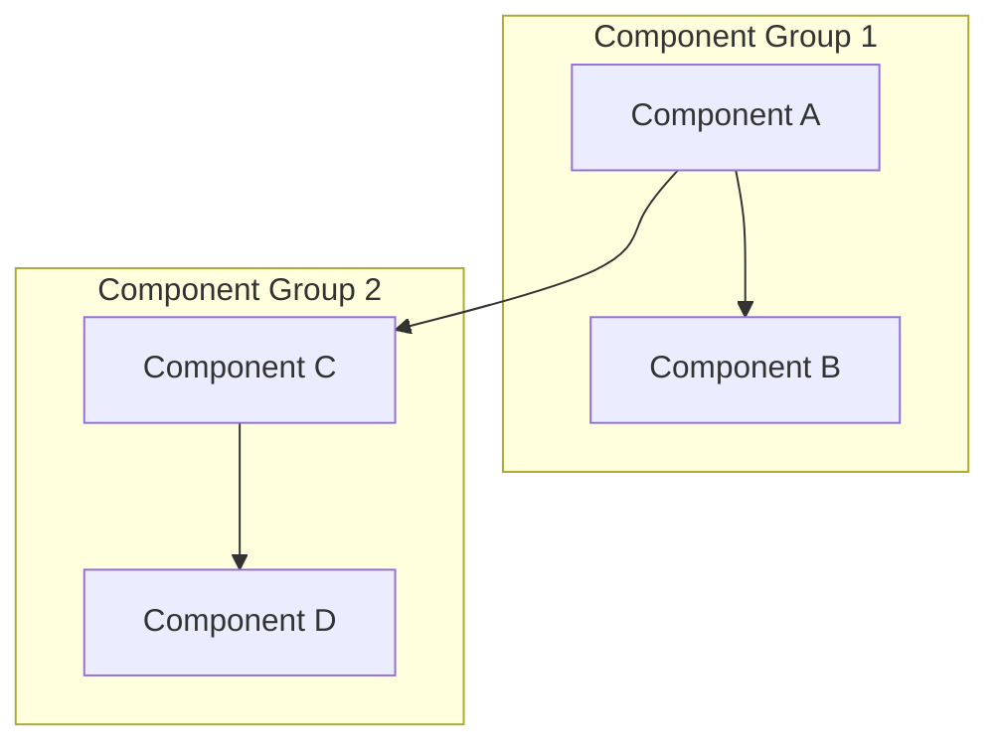
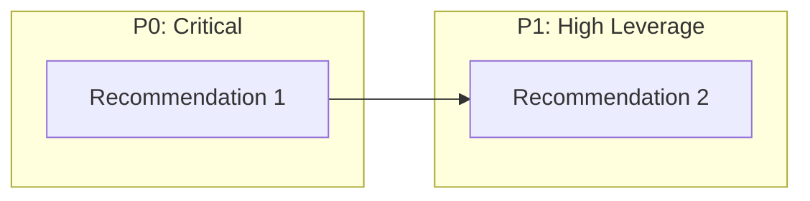

# Research Template

<!--
=== AGENT CONTEXT ===
Role: Research Agent
Project: [Fill from context]
Mode: research (PAS unconstrained mode)
-->

> **🎯 Your Role**: Conduct comprehensive research on a topic/feature before implementation planning.
> 
> **📋 When to Use This Template**:
> - Complex features requiring deep understanding
> - Multi-phase work needing architecture analysis
> - New technology/pattern evaluation
> - Debugging systemic issues
> 
> **⚠️ Section Optionality**: Mark sections as `N/A` with reasoning if not applicable.

---

## 1. Problem Statement & Context

> **Purpose**: Define what we're researching and why.

### Research Goal

[What are we trying to understand or solve?]

### Background Context

[Why is this research needed? What prompted it?]

### Success Criteria

[How will we know the research is complete?]

- [ ] Architecture understood
- [ ] Gaps identified with evidence
- [ ] Recommendations prioritized
- [ ] Implementation path clear

---

## 2. Current System Architecture

> **Purpose**: Document what exists before proposing changes.

### Architecture Diagram

### Key Components

| Component | File(s) | Purpose | Dependencies |
|-----------|---------|---------|--------------|
| [Name] | [path] | [what it does] | [what it uses] |

### Data Flow

[How does data move through the system?]

---

## 3. Deep Code Review

> **Purpose**: Understand existing implementation details.
> 
> **Mark N/A**: If researching new technology with no existing code.

### Files Analyzed

| File | Functions | Key Observations |
|------|-----------|------------------|
| [path] | `func1`, `func2` | [what you learned] |

### Implementation Patterns

[What patterns does the existing code follow?]

### Code Quality Observations

- **Strengths**: [What's done well]
- **Concerns**: [Technical debt, complexity]
- **Test Coverage**: [Are there tests? Quality?]

---

## 4. Gap Identification

> **Purpose**: Document what's missing or needs improvement.
> 
> **Evidence Required**: Each gap must have supporting evidence.

### Identified Gaps

| ID | Gap | Evidence | Impact |
|----|-----|----------|--------|
| G1 | [What's missing] | [How you know] | High/Medium/Low |
| G2 | [What's missing] | [How you know] | High/Medium/Low |

### Root Cause Analysis

[Why do these gaps exist?]

### Blast Radius

[What would be affected by addressing these gaps?]

---

## 5. External Research

> **Purpose**: Incorporate knowledge beyond the codebase.
> 
> **Mark N/A**: If pure internal code analysis.

### Sources Consulted

| Source | Type | Key Findings |
|--------|------|--------------|
| [URL/Paper] | Docs/Paper/Tool | [What you learned] |

### Industry Patterns

[What do others do in similar situations?]

### Relevant Technologies

| Technology | Fit | Pros | Cons |
|------------|-----|------|------|
| [Name] | Good/Partial/Poor | [Benefits] | [Drawbacks] |

---

## 6. Recommendations with Priority Matrix

> **Purpose**: Actionable next steps with prioritization.

### Priority Taxonomy

| Priority | Label | Criteria |
|----------|-------|----------|
| **P0** | Critical Path | Blocks other work or is foundational |
| **P1** | High Leverage | Provides significant value with reasonable effort |
| **P2** | Standard | Valuable but not urgent |
| **P3** | Deferred | Nice-to-have, low priority |

### Recommendations

| Priority | Recommendation | Addresses Gaps | Effort | Notes |
|----------|----------------|----------------|--------|-------|
| P0 | [Recommendation 1] | G1 | Low/Med/High | [Context] |
| P1 | [Recommendation 2] | G2 | Low/Med/High | [Context] |

### Implementation Phases

### Next Steps

1. [ ] [Immediate action]
2. [ ] [Follow-up action]
3. [ ] [Future consideration]

---

## Appendix

### Glossary

| Term | Definition |
|------|------------|
| [Term] | [Definition] |

### Related Artifacts

- [Link to related research]
- [Link to related implementation plan]
- [Link to roadmap phase]

### Session Context

**PAS Session**: `[uuid if applicable]`
**Conversation ID**: `[uuid]`
**Date**: [YYYY-MM-DD]
