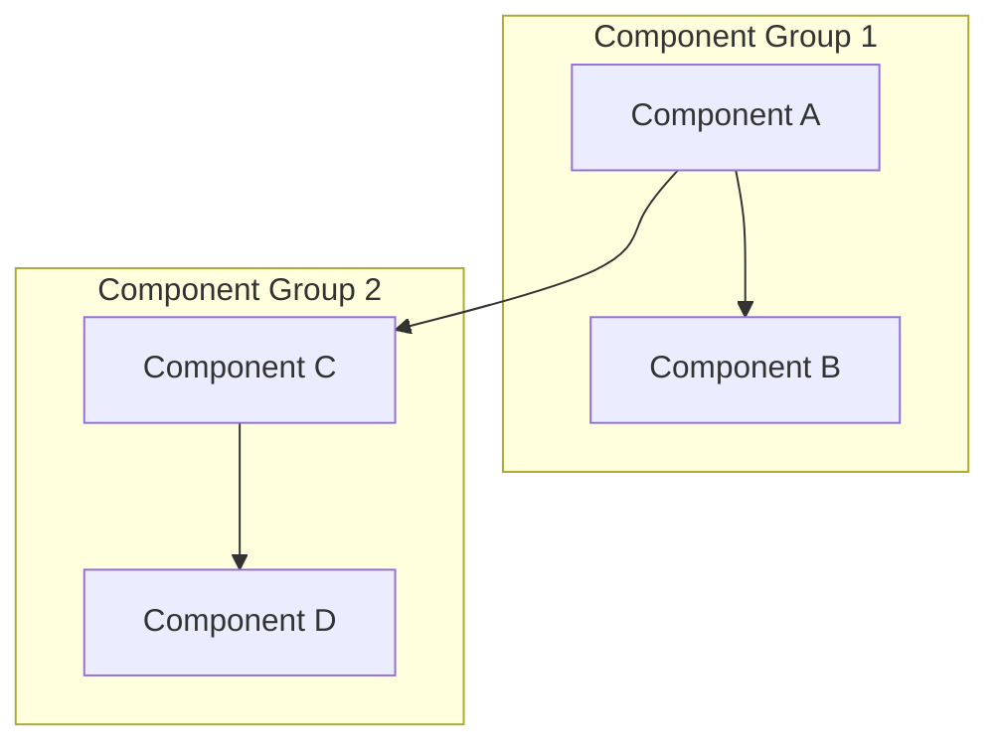

# Research Template

<!--
=== AGENT CONTEXT ===
Role: Research & Exploration Agent
Project: [Fill from PAS session project_id]
Mode: research
-->

> **🎯 Your Role**: Explore and understand, not solve. Document findings for future implementation.
> 
> **📋 Research Mode Mindset**:
> - State what you're trying to UNDERSTAND, not SOLVE
> - Exploration is valid - not every research leads to action
> - Document dead ends - they prevent future rework
> 
> **⚠️ Section Optionality**: Mark sections as `N/A` with reasoning if not applicable.

---

## 1. Research Objective

> [!TIP] **Research vs Implementation**
> Research answers "What/How/Why?" not "Do this."
> If you know the solution, use implementation_plan_template instead.

**Question**: [What are we trying to understand?]

**Scope**: [Boundaries of the research]

**Success Criteria**: [How do we know research is complete?]

- [ ] Architecture understood
- [ ] Gaps identified with evidence
- [ ] Recommendations prioritized
- [ ] Implementation path clear

---

## 2. Current System Architecture

> **Purpose**: Document what exists before proposing changes.
> 
> **Mark N/A**: If researching new technology with no existing code.

### Architecture Diagram

### Key Components

| Component | File(s) | Purpose | Dependencies |
|-----------|---------|---------|--------------|
| [Name] | [path] | [what it does] | [what it uses] |

---

## 3. Information Sources & Code Review

> [!IMPORTANT] **Source Attribution**
> Every finding must link to a source.
> Mark assumptions: "⚠️ Assumed: [statement]"

### Sources Consulted

| Source | Type | Reliability |
|--------|------|-------------|
| [Doc/File/URL] | Documentation | High/Medium/Low |
| [Codebase: file.py] | Code Analysis | High |
| [Conversation: id] | Prior Work | Medium |

### Files Analyzed

| File | Functions | Key Observations |
|------|-----------|------------------|
| [path] | `func1`, `func2` | [what you learned] |

---

## 4. Findings

> [!TIP] **Finding Format**
> - One finding per subsection
> - Link to source
> - Flag contradictions between sources

### Finding 1: [Title]

**Source**: [Link or reference]

**Summary**: [What was learned]

**Implications**: [How this affects the research question]

---

### Finding 2: [Title]

**Source**: [Link or reference]

**Summary**: [What was learned]

---

## 5. Gap Identification

> **Purpose**: Document what's missing or needs improvement.
> 
> **Evidence Required**: Each gap must have supporting evidence.

### Identified Gaps

| ID | Gap | Evidence | Impact |
|----|-----|----------|--------|
| G1 | [What's missing] | [How you know] | High/Medium/Low |
| G2 | [What's missing] | [How you know] | High/Medium/Low |

### Limitations & Uncertainty

> [!WARNING] **What's Missing?**
> - What couldn't be answered?
> - What assumptions remain unverified?
> - What would change the conclusions?

| Gap | Impact | Follow-up Needed? |
|-----|--------|-------------------|
| [What's missing] | [How it affects conclusions] | Yes/No |

---

## 6. Synthesis & Recommendations

> [!IMPORTANT] **Answer the Question**
> Connect findings to directly answer the research question.
> Acknowledge uncertainty and gaps.

### Answer to Research Question

[Synthesized understanding based on findings]

**Confidence**: High/Medium/Low

**Reasoning**: [Why this confidence level]

### Priority Taxonomy

| Priority | Label | Criteria |
|----------|-------|----------|
| **P0** | Critical Path | Blocks other work or is foundational |
| **P1** | High Leverage | Provides significant value with reasonable effort |
| **P2** | Standard | Valuable but not urgent |
| **P3** | Deferred | Nice-to-have, low priority |

### Recommendations

| Priority | Recommendation | Addresses Gaps | Effort | Notes |
|----------|----------------|----------------|--------|-------|
| P0 | [Recommendation 1] | G1 | Low/Med/High | [Context] |
| P1 | [Recommendation 2] | G2 | Low/Med/High | [Context] |

---

## 7. Next Steps

> [!TIP] **Research → Action**
> - If research complete: Create implementation_plan.md
> - If gaps remain: Define follow-up research
> - If dead end: Document why and close

- [ ] [Action 1]
- [ ] [Action 2]

---

## Pre-Submission Checklist

> **Research Quality Checks**:
> - Findings linked to sources (not just opinions)
> - Contradictions flagged and resolved
> - Confidence level justified
> - Gaps acknowledged

- [ ] Research question clearly stated
- [ ] Architecture documented (or marked N/A)
- [ ] All findings linked to sources
- [ ] Gaps and limitations acknowledged
- [ ] Synthesis answers the research question
- [ ] Confidence level stated with reasoning
- [ ] Recommendations prioritized (P0-P3)
- [ ] Next steps defined

---

## Appendix

### Related Artifacts

- [Link to related implementation plan]
- [Link to roadmap phase]

### Session Context

**PAS Session**: `[uuid if applicable]`
**Conversation ID**: `[uuid]`
**Date**: [YYYY-MM-DD]

---

> **📋 Mode Reminder**: Research mode explores possibilities.
> Implementation mode executes solutions. Don't mix them.
