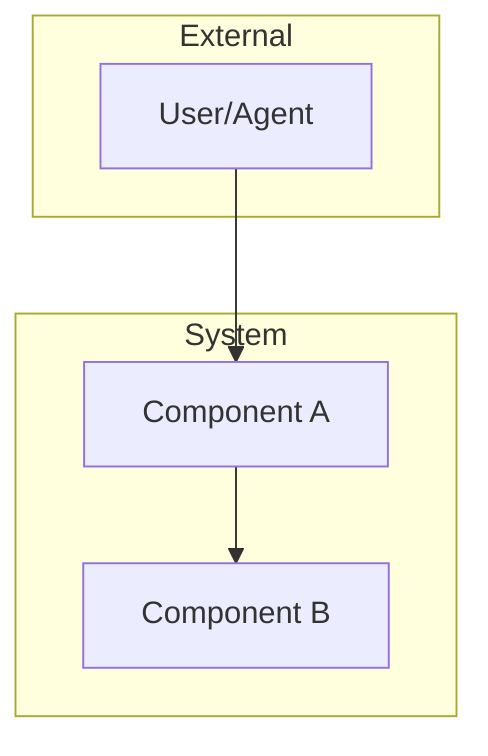
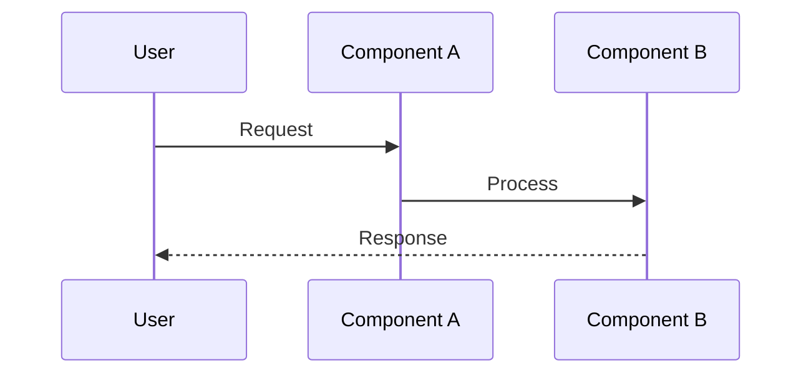

# Roadmap Template

<!--
=== AGENT CONTEXT ===
Role: Strategic Planning Agent
Project: [Fill from PAS session project_id]
Mode: implementation (multi-phase)
-->

> **🎯 Your Role**: Create a self-sufficient roadmap that a new agent session can execute without conversation context.
> 
> **📋 Active Constraints** (verify via `start_reasoning_session`):
> - 🚫 `quality_gate_threshold`: 0.9 (BLOCKING)
> - ⚠️ `roadmap_vs_plan_distinction`: true
> - ⚠️ Each phase needs separate PAS session

---

## Problem Statement

> [!TIP] **Self-Sufficiency Check**
> A new agent must understand this roadmap without conversation history.
> Include: Why this matters, what success looks like, key constraints.

**What problem does this solve?**
[Describe the pain point or gap]

**Why is this important?**
[Business/technical justification]

**PAS Session Evidence**:
- **Session ID**: `[uuid]`
- **Decision Quality**: HIGH/MEDIUM/LOW
- **Final Score**: [≥0.9 required]
- **Gap**: [≥0.08 required]

---

## Architecture

> [!IMPORTANT] **Diagram Required**
> At least one mermaid diagram mandatory.
> Prefer: System context → Component → Data flow

### System Context Diagram

### Data Flow

---

## Phases

> [!IMPORTANT] **Per-Phase Requirements**
> Each phase MUST have:
> - Its own PAS reasoning session (score ≥0.9)
> - Separate implementation_plan.md
> - Independent verification checklist

### Phase 1: [Name]

**Scope**: [What's included]
**Dependencies**: [What must exist first]
**PAS Session Required**: YES → [link to plan]
**Estimated Effort**: low/medium/high

#### Dual Recommendation

| Balanced | Aspirational |
|----------|--------------|
| [Chosen approach] | [Higher-value alternative] |
| Effort: [1-3] | Effort: [1-3] |
| Benefit: [1-3] | Benefit: [1-3] |
| ✅ Recommended | Consider if constraints relax |

#### Success Criteria
- [ ] [Verifiable criterion 1]
- [ ] [Verifiable criterion 2]

---

### Phase 2: [Name]

**Scope**: [What's included]
**Dependencies**: Phase 1 completion
**PAS Session Required**: YES → [link to plan]
**Estimated Effort**: low/medium/high

#### Success Criteria
- [ ] [Verifiable criterion 1]

---

## Cross-Phase Decisions

> [!TIP] **Decision Traceability**
> Link each decision to PAS reasoning node for auditability.

| Decision | Options Considered | Chosen | Rationale (PAS node) |
|----------|-------------------|--------|---------------------|
| [What] | A, B, C | B | [node_id: why] |

---

## Success Criteria

> [!IMPORTANT] **Verifiable Outcomes**
> "It works" is not a criterion. Use measurable outcomes.

- [ ] [Overall success criterion 1]
- [ ] [Overall success criterion 2]

---

## Environment

> [!WARNING] **Terminal Commands**
> All commands require venv activation.

| Item | Value |
|------|-------|
| **Venv** | `.venv312/bin/activate` |
| **Activation** | `source .venv312/bin/activate && set -a && source .env && set +a` |

---

## Pre-Submission Checklist

> **⚠️ Known Issues to Watch For**:
> - Multi-phase scope creep (each phase should be independently verifiable)
> - Missing phase dependencies (check order carefully)
> - Vague success criteria (must be measurable)

- [ ] PAS session score ≥ 0.9
- [ ] At least one mermaid diagram included
- [ ] Each phase has clear scope and dependencies
- [ ] Success criteria are verifiable (not vague)
- [ ] Design decisions link to PAS reasoning
- [ ] Roadmap is self-sufficient (no conversation context needed)

---

> **📋 Constraint Reminder**: Each phase becomes a separate PAS session.
> Do not mix multiple phases into a single implementation plan.
