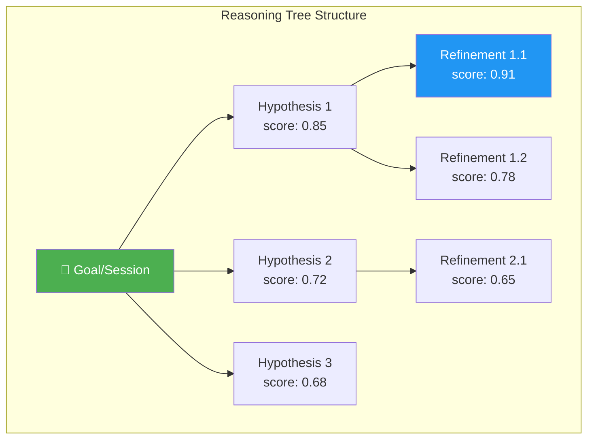
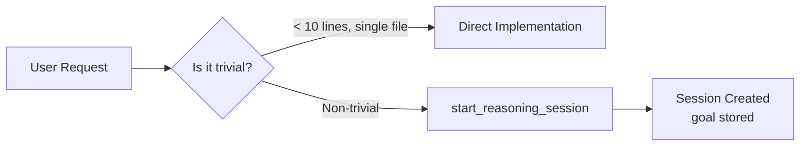
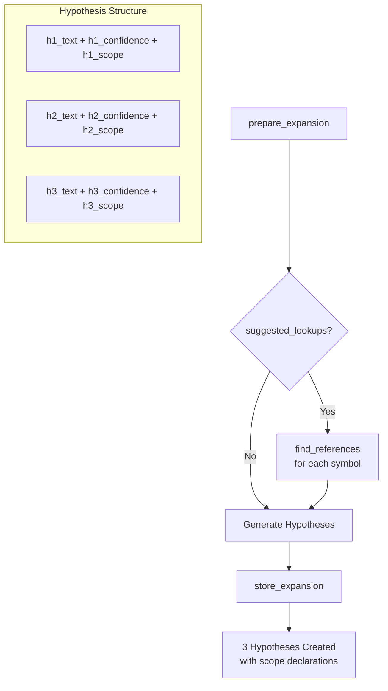
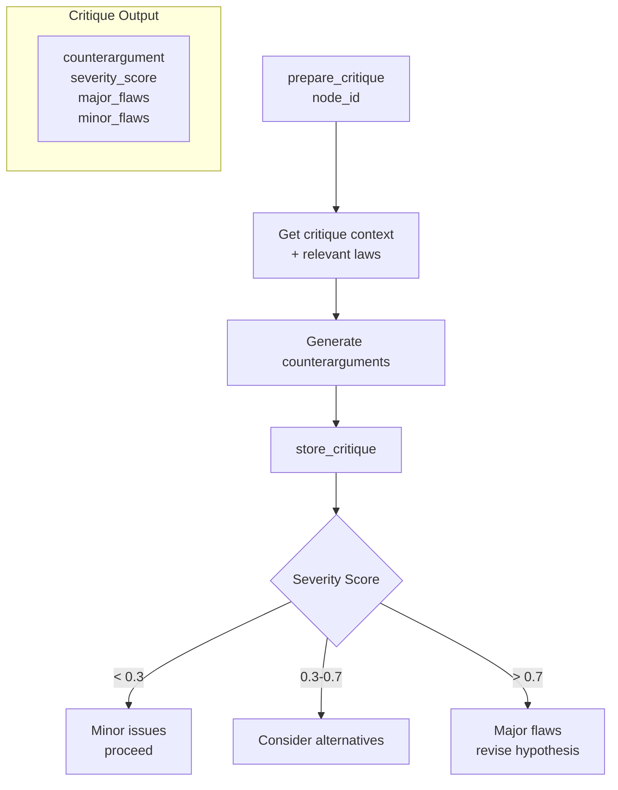
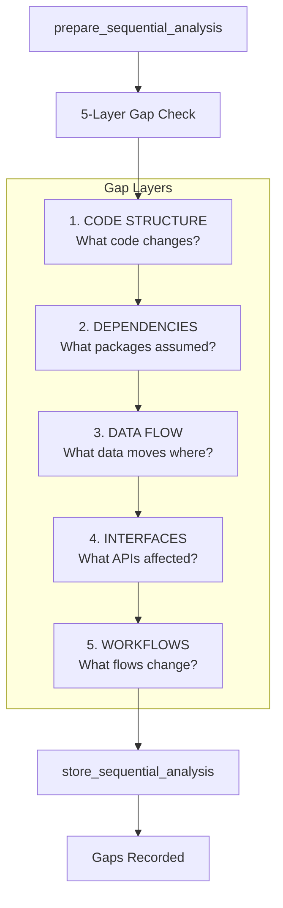
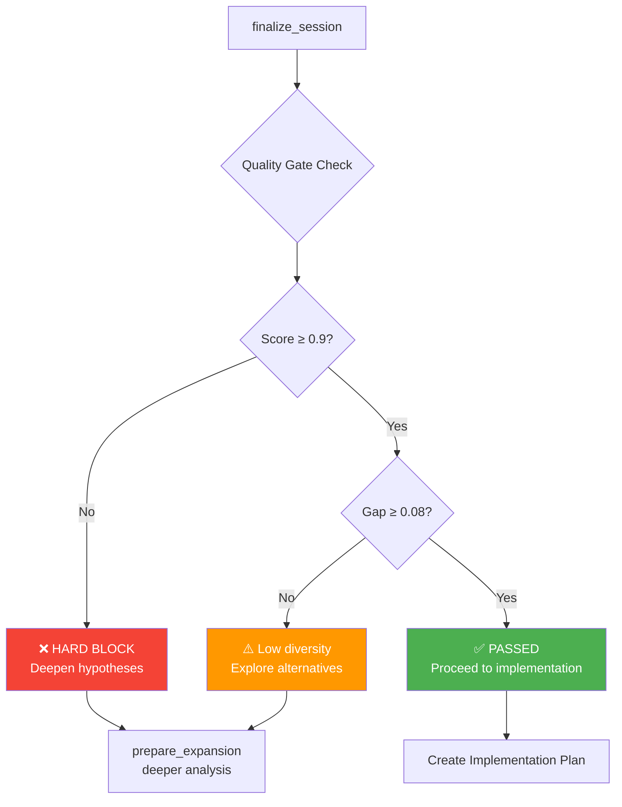
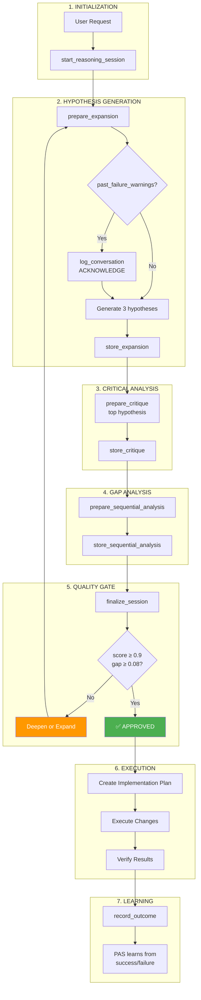
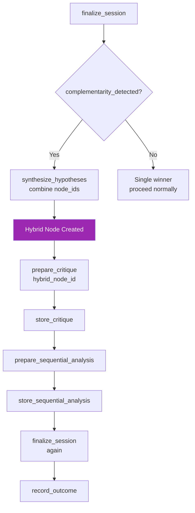
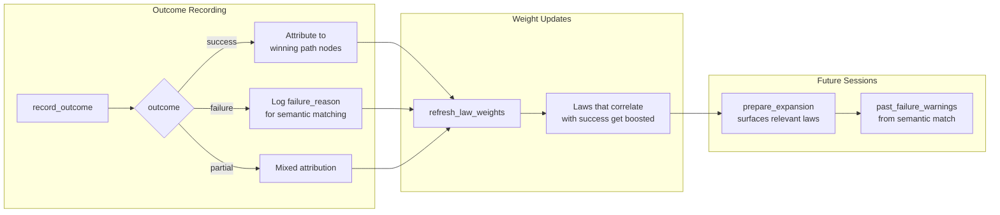

# PAS Reasoning Logic Report

> **Purpose-Aware Scaffolding (PAS)** is a scientific reasoning system that applies Bayesian hypothesis testing and psychological laws to software development decisions.

---

## Executive Summary

PAS enforces a structured decision-making process: **Hypothesize → Critique → Execute → Learn**. Every non-trivial change must pass through this workflow, ensuring decisions are grounded in evidence and past learning is incorporated into future reasoning.

---

## Core Architecture

### The Reasoning Tree

PAS builds a **Tree of Thought (ToT)** where each node represents a hypothesis. Nodes are scored using Bayesian posteriors, and the system tracks:

- **Prior probability** (initial confidence)
- **Likelihood** (evidence from critiques)
- **Posterior** (updated score after critique)

---

## Complete PAS Workflow

### Phase 1: Session Initialization

### Phase 2: Hypothesis Generation

### Phase 3: Critical Analysis

### Phase 4: Gap Analysis (Mandatory)

### Phase 5: Quality Gate & Finalization

---

## Complete End-to-End Flow

---

## Synthesis Flow (When Hypotheses Are Complementary)

---

## Tool Call Sequence (Quick Reference)

| Step | Tool | Purpose |
|------|------|---------|
| 1 | `start_reasoning_session` | Create session with goal |
| 2 | `prepare_expansion` | Get context + relevant laws |
| 3 | `find_references` | (if suggested_lookups) Scope analysis |
| 4 | `store_expansion` | Save 3 hypotheses with scores |
| 5 | `prepare_critique` | Get critique context |
| 6 | `store_critique` | Save counterarguments + severity |
| 7 | `prepare_sequential_analysis` | Get gap analysis prompts |
| 8 | `store_sequential_analysis` | Save 5-layer gap results |
| 9 | `finalize_session` | Quality gate check |
| 10 | `record_outcome` | Log success/failure for learning |

---

## Quality Gates

### Hard Blocks (Cannot Proceed)

| Check | Threshold | Action if Failed |
|-------|-----------|------------------|
| Score | ≥ 0.9 | Expand deeper, add hypotheses |
| Gap | ≥ 0.08 | Explore diverse alternatives |
| Synthesis | Must critique hybrid | Cannot skip |

### Soft Warnings

| Warning | Source | Required Action |
|---------|--------|-----------------|
| `past_failure_warnings` | Previous failures | Acknowledge in `log_conversation` |
| `preflight_warnings` | Missing checks | Complete required lookups |
| `missing_codebase_research` | No query_codebase | Research before hypothesizing |

---

## Learning Loop

---

## Key Principles

1. **Think First, Implement Later** - No code without reasoning
2. **Critique Before Commit** - Every hypothesis must be challenged
3. **Learn From Outcomes** - Success/failure updates law weights
4. **Quality Over Speed** - Hard blocks prevent low-quality decisions
5. **Scope Awareness** - Declare affected files/modules upfront

---

*Generated: 2026-02-02 | PAS v94+*
